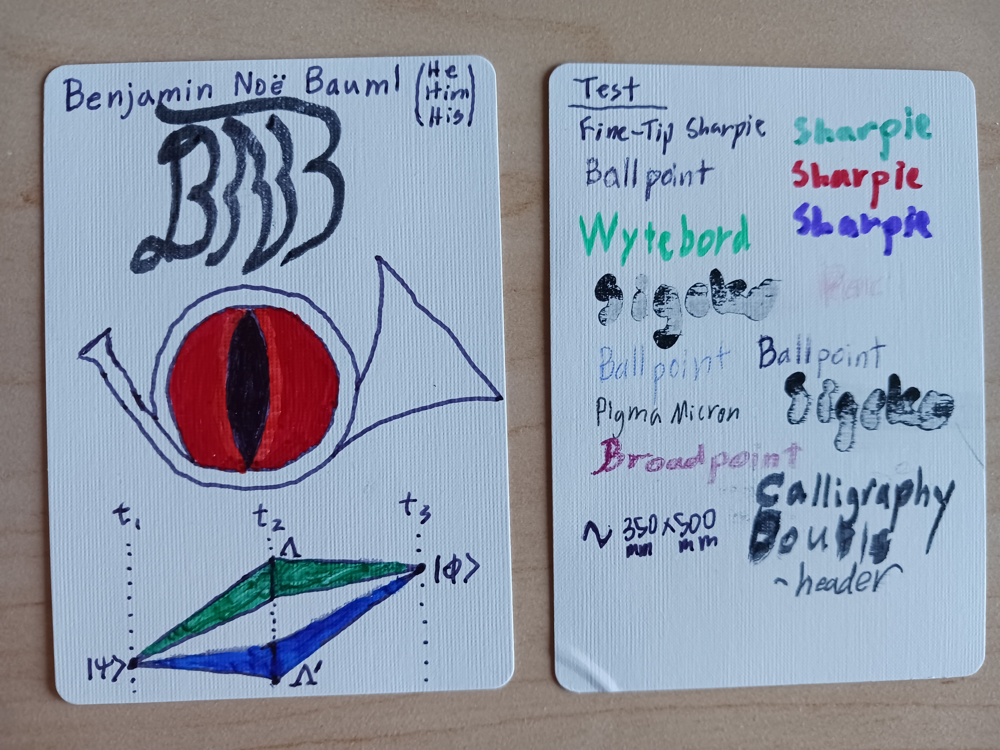
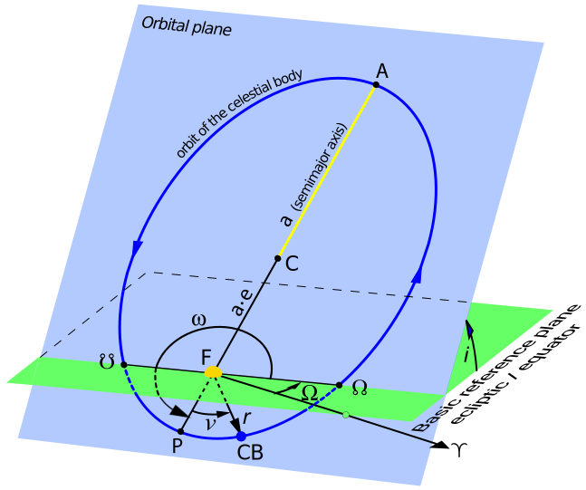
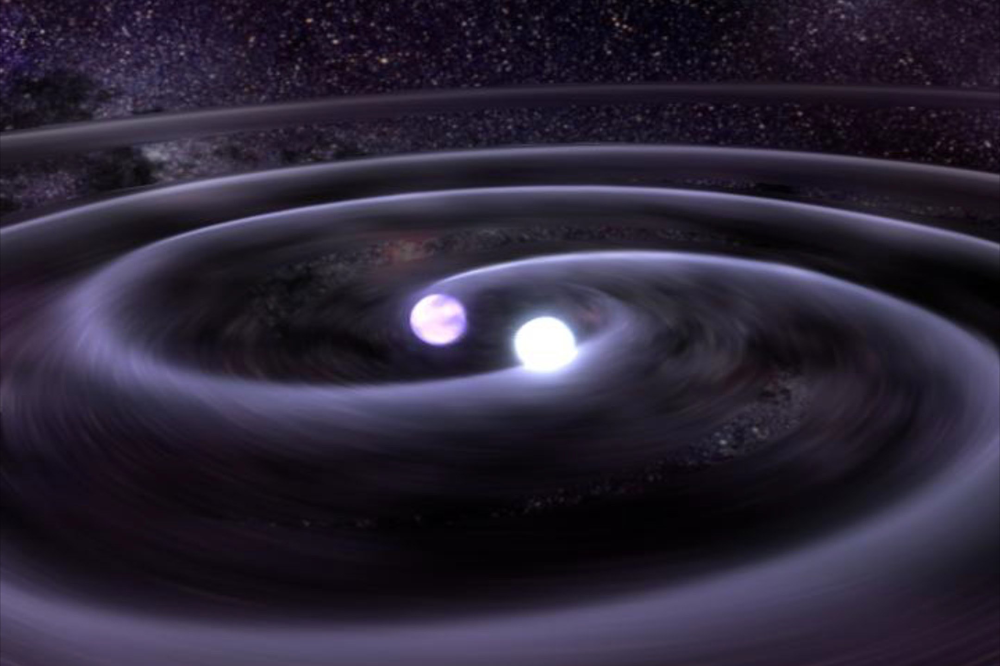

---
tags:
  - format/assignment2024-06-14
  - format/lecture2024-06-15
  - content/kinematics
  - content/forces
  - content/energy
  - content/momentum
  - modality/in-person
---
# PH 211 2024 Summer Lecture 1
## Files
[PH 211 Lecture 1 TeX](PH_211_Lecture_1.tex)
[PH 211 Lecture 1 PDF](PH_211_Lecture_1.pdf)
[PH 211 Lecture 1 Slides TeX](PH_211_Lecture_1_Slides.tex)
[PH 211 Lecture 1 Slides PDF](PH_211_Lecture_1_Slides.pdf)

## Activities
Introductions
Course Structure and Policies
Introduction to Physics, Motion, and Model Building
Principles for Success
## Notes
* Added to Vault
	* Assignment Format 2024-06-14
	* Lecture Format 2024-06-15
	* Images from Wikimedia Commons.
		* Orbital Elements image released under CC-BY 4.0 by Mliu92
		* Gravitational Waves image released to public domain by NASA
			* Credit: Tod Strohmayer (GSFC), CXC, NASA - Illustration: Dana Berry (CXC)
	* Links in Slides PDF broken.