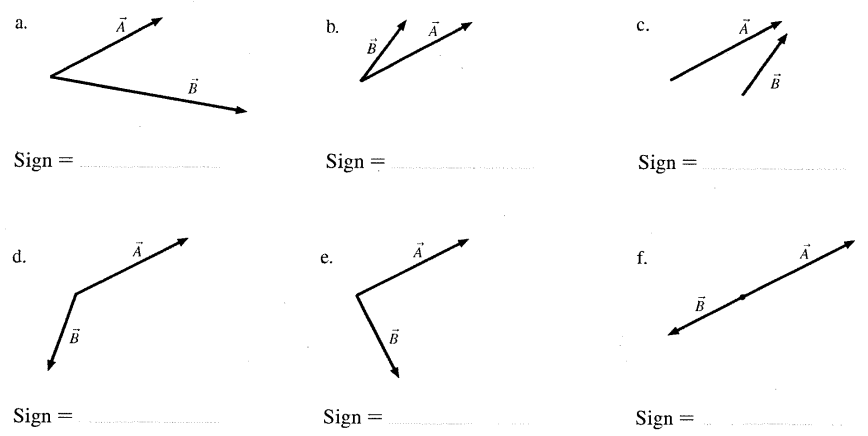
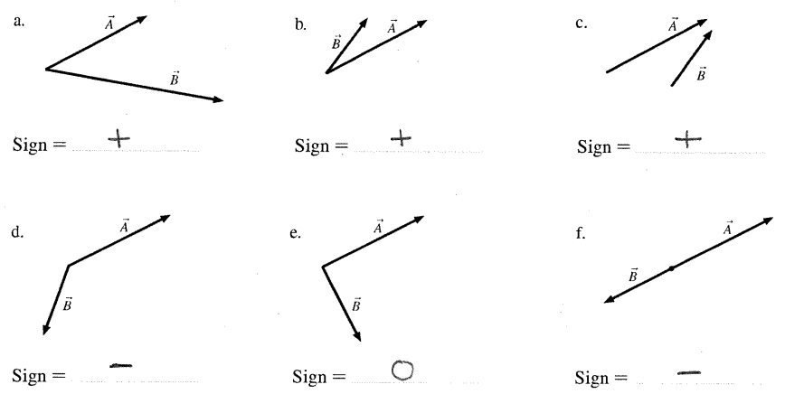
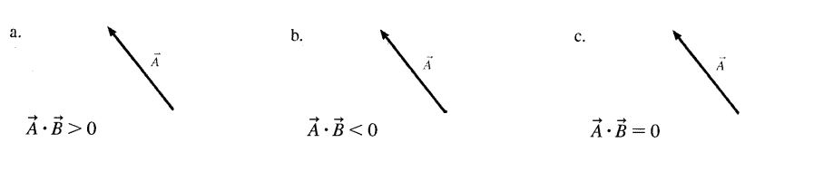
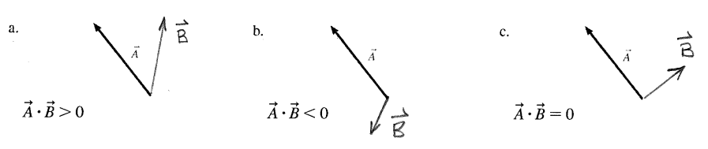

---
tags:
  - usage/PH211/quarter/Sp2024/Week7
  - usage/PH211/section_type/recitation
  - format/assignment2024-04-27
  - modality/in-person
  - content/vectors/dot_product
  - learning_objectives/representations
  - time/short
  - source/Knight/chapter9/workbook
  - content/energy/work
  - content/scalars
---
# Visual Dot Product Practice
## Spring 2024
[Visual Dot Product Practice TeX](./Visual_Dot_Product_Practice.tex)
[Visual Dot Product Practice Preview TeX](./Visual_Dot_Product_Practice_Preview.tex)
[Visual Dot Product Practice Preview PDF](./Visual_Dot_Product_Practice_Preview.pdf)
* Added to Vault
	* Assignment Format Version 2024-04-27
	* Four borrowed images
		* 
		* 
		* 
		* 