---
tags:
  - content/representations
  - learning_objectives/representations
---
# Ball Braced Between Two Angled Surfaces

* #source/Paul_Emigh #usage/PH211 #content/forces #content/forces/normal #content/vectors/forces #content/vectors/components/trigonometry #learning_objectives/critical_thinking/sensemaking 
# Ball Tower Drop

* #source/Paul_Emigh #usage/PH211/quarter/Sp2024 #usage/PH211/section_type/lecture #to-do/tag
# Block A Hits Block X or Block Y
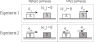
* #source/Paul_Emigh #usage/PH211 #to-do/tag
# Block and Weight versus Block and Pull

* #source/Paul_Emigh #usage/PH211/quarter/Sp2024 #usage/PH211/section_type/lecture #to-do/tag
# Block on Downward Ramp Attached to Block Over Edge
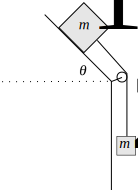
* #source/Paul_Emigh #usage/PH211 #content/forces #content/forces/normal #content/forces/gravity #content/vectors/components/trigonometry #content/coordinate_systems #learning_objectives/Newton_and_conservation_laws #content/forces/friction/static #content/forces/friction/kinetic #content/representations/free-body_diagrams #content/forces/tension #content/energy/gravitational_potential #content/energy/kinetic #content/energy/thermal
# Block on Ramp Attached to Block Over Edge

* #source/Paul_Emigh #usage/PH211 #content/forces #content/forces/normal #content/forces/gravity #content/vectors/components/trigonometry #content/coordinate_systems #learning_objectives/Newton_and_conservation_laws #content/forces/friction/static #content/forces/friction/kinetic #content/representations/free-body_diagrams #content/forces/tension #content/energy/kinetic #content/energy/gravitational_potential #content/energy/thermal
# Block on Ramp with Friction

* #source/Paul_Emigh #usage/PH211 #content/forces #content/forces/normal #content/forces/gravity #content/vectors/components/trigonometry #content/coordinate_systems #learning_objectives/Newton_and_conservation_laws #content/forces/friction/static #content/forces/friction/kinetic #content/representations/free-body_diagrams #content/energy/kinetic #content/energy/thermal 
# Block on Ramp with Hand Support

* #source/Paul_Emigh #usage/PH211 #content/forces #content/forces/normal #content/forces/gravity #content/vectors/components/trigonometry #content/coordinate_systems #learning_objectives/Newton_and_conservation_laws #content/forces/friction/static #content/forces/friction/kinetic #content/representations/free-body_diagrams #content/energy/kinetic #content/energy/gravitational_potential #content/energy/thermal #content/energy/work
# Block on Upward Ramp Attached to Block Over Edge
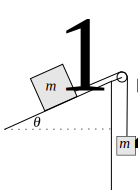
* #source/Paul_Emigh #usage/PH211 #content/forces #content/forces/normal #content/forces/gravity #content/vectors/components/trigonometry #content/coordinate_systems #learning_objectives/Newton_and_conservation_laws #content/forces/friction/static #content/forces/friction/kinetic #content/representations/free-body_diagrams #content/forces/tension #content/energy/gravitational_potential #content/energy/kinetic #content/energy/thermal
# Cart Released at Top of Bent Ramp

* #source/Paul_Emigh #usage/PH211/section_type/lecture #usage/PH211/quarter/Sp2024  #content/representations/motion_diagrams #content/energy/work #content/energy/kinetic #content/energy/gravitational_potential #content/forces/gravity #content/forces/normal #learning_objectives/point_model #learning_objectives/Newton_and_conservation_laws 
# Curved Ramp Concave Up on Bottom Down on Top

#source/Paul_Emigh #usage/PH211 #to-do/tag
# Descending Motion Speed Up then Slow Down

* #source/Paul_Emigh #usage/PH211 #to-do/tag
# Descending Strobe Speed Up then Slow Down

* #source/Paul_Emigh #usage/PH211 #to-do/tag
# Eleven Helps Mike and Lucas Push a Box

#source/Paul_Emigh #usage/PH211/section_type/studio #usage/PH211/quarter/Sp2024 
# FBD for Box Sliding Along Table

#source/Paul_Emigh #usage/PH211 #to-do/tag
# FBD for Box Sliding on Ground with Mystery Force

#source/Paul_Emigh #usage/PH211 #to-do/tag
# FBD for Sandwiched Block

* #source/Paul_Emigh #usage/PH211 #to-do/tag
# FBDs for Two Block Stack
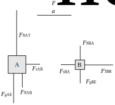
#source/Paul_Emigh #usage/PH211 #to-do/tag
# Five Time Accelerating Motion Diagram

* #source/Paul_Emigh #usage/PH211/section_type/lecture #usage/PH211/quarter/Sp2024 #to-do/tag
# Gymnast Suspended with Equal Angles

* #source/Paul_Emigh #usage/PH211/quarter/Sp2024 #usage/PH211/section_type/lecture #to-do/tag
# Gymnast Suspended with Unequal Angles

* #source/Paul_Emigh #usage/PH211/quarter/Sp2024 #usage/PH211/section_type/lecture #usage/PH211/homework #to-do/tag
# Knobby Ball with Spring on Ramp

* #source/Paul_Emigh #usage/PH211 #content/forces/normal #content/forces/gravity #content/forces/spring #content/forces/friction #content/energy/kinetic #content/energy/gravitational_potential #content/energy/spring_potential #content/oscillations
# Marble with Three Launch Angles

* #source/Paul_Emigh #usage/PH211/section_type/lecture #usage/PH211/quarter/Sp2024 #to-do/tag
# Mario Activity Acceleration versus Time

* #source/Paul_Emigh #usage/PH211/quarter/Sp2024 #usage/PH211/section_type/lecture #to-do/tag
* Has source code: [Mario Mathematica Code](mario.nb)
# Mario Activity Position versus Time
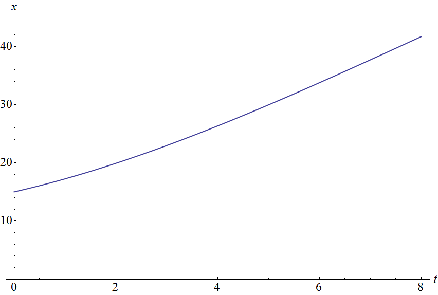
* #source/Paul_Emigh #usage/PH211/quarter/Sp2024 #usage/PH211/section_type/lecture #to-do/tag
* Has source code: [Mario Mathematica Code](mario.nb)
# Mario Activity Velocity versus Time
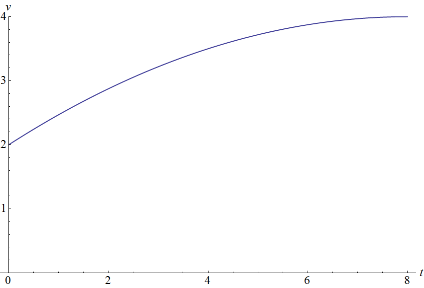
* #source/Paul_Emigh #usage/PH211/quarter/Sp2024 #usage/PH211/section_type/lecture #to-do/tag
* Has source code: [Mario Mathematica Code](mario.nb)
# Mass with Vertical Spring Below and Pulley Above Linking to Horizontal Spring
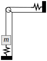
* #source/Paul_Emigh #usage/PH211 #to-do/tag
# Masses Slung Across Peak

* #source/Paul_Emigh #usage/PH211 #to-do/tag
# Meeple off a Diving Board
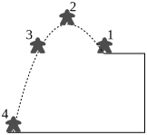
* #usage/PH211 #content/kinematics/projectile_motion #content/forces/gravity #content/representations/motion_diagrams #content/kinematics/free_fall #source/Paul_Emigh
# Mike and Lucas Fruitlessly Push a Box

#source/Paul_Emigh #usage/PH211/section_type/studio #usage/PH211/quarter/Sp2024 #to-do/tag
# Obtuse Dot Product

* #source/Paul_Emigh #usage/PH211 #to-do/tag
# Pendulum Swing to Equilibrium
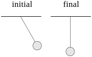
* #source/Paul_Emigh #usage/PH211 #to-do/tag
# Position Graphs Meet
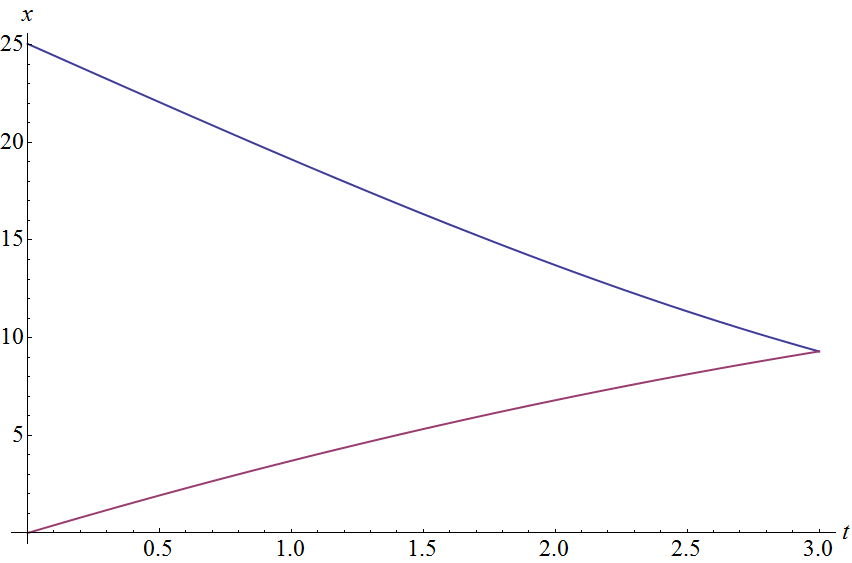
* #source/Paul_Emigh #usage/PH211 #to-do/tag
# Pulled Block Stack Linked to Hanging Block
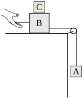
* #source/Paul_Emigh #usage/PH211 #to-do/tag
# Rocket Aimed Down

* #source/Paul_Emigh #usage/PH211 #to-do/tag
# Rocket Aimed Up

* #source/Paul_Emigh #usage/PH211 #to-do/tag
# Sled Pulled by Four Dogs
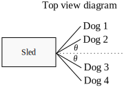
* #source/Paul_Emigh #usage/PH211 #to-do/tag
# Sled Pulled by Two Dogs

* #source/Paul_Emigh #usage/PH211 #to-do/tag
# Sliding Block Pulled Back by Angled F(x)
.svg)
* #source/Paul_Emigh #usage/PH211 #content/forces #content/forces/tension #content/vectors/forces #content/vectors/velocity #content/vectors/components/trigonometry 
# Spring and Block on Ramp

* #source/Paul_Emigh #usage/PH211 #to-do/tag
# Stack of Blocks Sliding as a Group
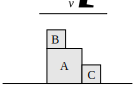
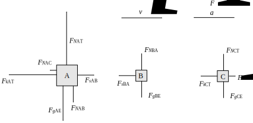
* #source/Paul_Emigh #usage/PH211 #content/forces #content/forces/tension #content/vectors/forces #content/vectors/velocity #content/vectors/components/trigonometry #content/vectors/acceleration #content/forces/friction #content/forces/normal #content/forces/gravity #content/forces/interactions #content/representations/free-body_diagrams
# Sum of Three Equal Vectors

* #source/Paul_Emigh #usage/PH211 #to-do/tag
# Symmetric Speed-Up Slow-Down

* #source/Paul_Emigh #usage/PH211 #to-do/tag
# Three Balls Collide

* #content/vectors/velocity #usage/PH211 #content/vectors/momentum #content/coordinate_systems #content/vectors/components/trigonometry #content/momentum/collisions #learning_objectives/Newton_and_conservation_laws #source/Paul_Emigh
# Three Brick Pile Push

* #source/Paul_Emigh #usage/PH211/quarter/Sp2024 #usage/PH211/section_type/studio #to-do/tag
# Three Brick Pile Push Less Friction

* #source/Paul_Emigh #usage/PH211/quarter/Sp2024 #usage/PH211/section_type/studio #to-do/tag
# Two Blocks Linked by Spring

* #source/Paul_Emigh #usage/PH211 #to-do/tag
# Two Pendula Collide

* #source/Paul_Emigh #usage/PH211 #content/momentum/collisions #content/energy/gravitational_potential #content/energy/kinetic #learning_objectives/Newton_and_conservation_laws 
# Vector to A from B

* #source/Paul_Emigh #usage/PH211 #to-do/tag
# Velocity Vectors for Two Sprinters
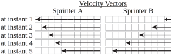
* #source/Paul_Emigh #usage/PH211 #to-do/tag